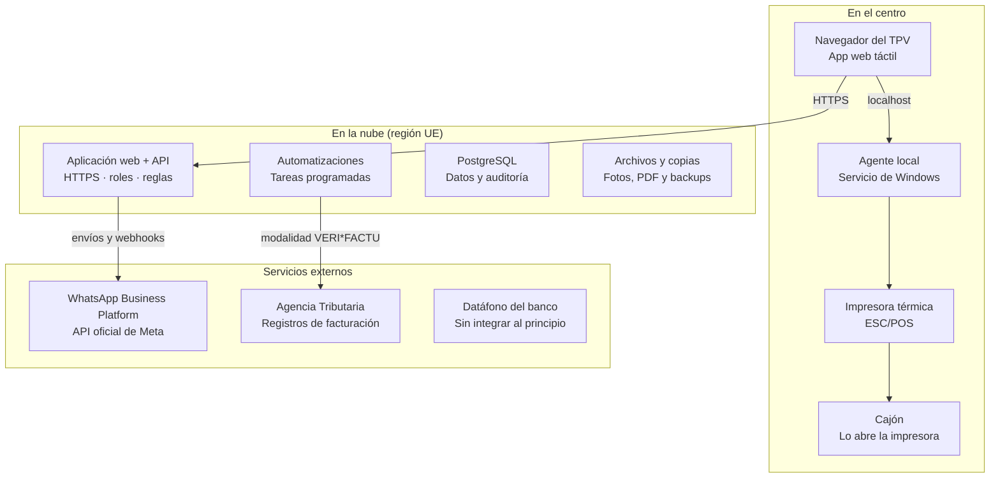

# Adela María — Plan Maestro

2026-10-08 · @Espe

## Resumen

La aplicación de Adela María será una aplicación web alojada en la nube, usada desde el navegador del TPV táctil, con un pequeño agente en Windows para la impresora y el cajón. Se construye en 9 fases (0 a 8) y cada una entra en uso real en el centro antes de empezar la siguiente.

Este documento es solo el plan. No se ha escrito código.

| Decisión | Propuesta | Motivo |
| --- | --- | --- |
| Tipo de aplicación | Web en la nube, región UE | WhatsApp oficial necesita un servidor público con HTTPS; copias y soporte remoto más sencillos; acceso también desde el móvil |
| Impresora y cajón | Agente local en Windows que habla ESC/POS | Un navegador no controla dispositivos USB de forma fiable |
| Base de datos | PostgreSQL | Impide la doble reserva desde la propia base de datos y guarda historial de cambios |
| WhatsApp | Dos pasos: primero enlaces de "clic para chatear", después la API oficial | Valor desde el primer mes sin coste ni trámites con Meta |
| Cobro con tarjeta | Datáfono del banco sin integrar al principio | La app nunca toca datos de tarjeta; integrar depende del banco |
| Facturación | Registro inalterable desde el primer día; conexión VERI*FACTU en fase propia | La especificación oficial se estudia antes de programar nada fiscal |
| Primer entregable | Agenda + clientas + tratamientos | Es lo que se usa cada día y no tiene riesgo fiscal |

## Conflictos y riesgos detectados

Hay doce puntos que conviene resolver o aceptar antes de programar. Los cuatro primeros cambian el plan si la respuesta es distinta a la que supongo.

1. **Nombre y marca.** Resuelto: el centro y la aplicación se llaman Adela María · Belleza holística y usan su logo.
2. **Quien programa la facturación es el "productor" del sistema.** Según la Agencia Tributaria, cada sistema de facturación en uso necesita una declaración responsable de su productor, también si es un desarrollo propio, y una por cada versión. La Ley General Tributaria (art. 201 bis) recoge una infracción específica por producir o tener sistemas que no cumplan. Decidido: la productora será Adela, titular del centro, y ella firma la declaración. Según las preguntas frecuentes de la Agencia Tributaria, esto encaja cuando el usuario desarrolla el sistema con medios propios o con personal contratado que depende de él; si se le entrega como producto de un tercero, la productora sería esa tercera persona. La forma del encargo debe reflejarlo y la gestoría confirmarlo.
3. **El calendario fiscal está en movimiento.** Hoy la fecha vigente es 1 de enero de 2027 para sociedades y 1 de julio de 2027 para el resto. El 5 de octubre de 2026 Hacienda anunció que prevé aplazarlo a octubre de 2028; todavía no está aprobado. Adela es autónoma, así que su fecha vigente es el 1 de julio de 2027.
4. **Construir frente a comprar.** Ya existen programas para centros de estética con agenda, TPV y facturación adaptada. Hacerlo a medida tiene sentido por los avisos inteligentes, el seguimiento y el control total; el precio es mantenerlo y asumir el punto 2. Decidido: se construye a medida, incluido el motor fiscal.
5. **Alcance muy amplio para un centro pequeño.** Son 24 módulos. El riesgo es tardar meses sin que el centro use nada. Por eso cada fase termina en algo utilizable.
6. **Datos de salud.** Contraindicaciones, consentimientos informados y fotos de antes y después son datos sensibles para el RGPD. Van en una fase tardía, con cifrado y consentimiento expreso, y conviene revisarlos con un asesor de protección de datos.
7. **Bonos y tarjetas regalo tienen fiscalidad propia.** Cuándo se factura un bono (al venderlo o al usarlo) y cómo tributa una tarjeta regalo lo debe confirmar la gestoría. El sistema quedará preparado para ambas respuestas.
8. **Dependencia de internet.** Una app en la nube no funciona sin conexión. Plan B: compartir datos desde el móvil y dejar la agenda del día consultable sin conexión.
9. **WhatsApp oficial tiene coste y reglas.** Meta cobra por cada plantilla entregada fuera de la ventana de 24 horas, las plantillas pasan aprobación y hace falta consentimiento de cada clienta. Queda por verificar si el número actual del centro puede seguir usándose en la app del móvil a la vez.
10. **Servicios muy cortos y baratos.** La tarifa de depilación tiene servicios de 5 minutos y 3 €. La agenda trabajará en tramos de 5 minutos, una cita podrá llevar varios servicios y el cobro debe resolverse en tres toques.
11. **Los bonos faciales valen para cualquier facial.** La tarifa los describe como "adaptados a las necesidades de tu piel". Un bono se ligará a un grupo de tratamientos, no a uno solo.
12. **Hay clientes hombres.** La tarifa incluye servicios de caballero. "Clientas" será solo la etiqueta del menú.

Comisiones, varios profesionales y roles entran en el modelo de datos desde el principio, pero sus pantallas llegan en fases posteriores.

## Arquitectura

Una sola aplicación web en la nube atiende al TPV, al móvil de la propietaria y a los servicios externos. En el centro solo se instala un agente pequeño para la impresora y el cajón.



El navegador del TPV habla con la app por internet y con el agente local dentro del propio equipo. Solo la nube habla con Meta y con la Agencia Tributaria.

Principios de diseño:

- **Una aplicación, módulos internos.** Agenda, clientas, TPV, facturación, stock y avisos son módulos de un mismo programa. Sin microservicios: menos piezas que se puedan romper.
- **Las reglas viven en el servidor.** El navegador solo muestra y pide. Lo crítico lo impone la base de datos: no hay doble reserva, un bono no baja de cero y un registro de facturación no se edita ni se borra.
- **Todo cambio importante deja rastro.** Quién creó, modificó, cobró, anuló o cerró caja, con fecha y valor anterior.
- **Un motor de avisos único.** Tareas programadas revisan reglas (cita sin confirmar, stock bajo, bono a punto de caducar, clienta inactiva) y generan avisos, tareas o mensajes. Cada regla se activa y ajusta desde Configuración.
- **Hardware detrás de una interfaz.** La app pide "imprimir ticket" o "abrir cajón"; el agente traduce al modelo concreto. Cambiar de impresora no toca la app.
- **Agenda con API.** Queda preparada para reserva online o un asistente externo, aunque no se active al principio.

## Tecnología

Todo el proyecto usa un solo lenguaje, TypeScript, y piezas muy extendidas y bien documentadas. Los nombres de proveedor son propuestas; planes y precios se comprueban en la fase 0.

| Capa | Propuesta | Motivo |
| --- | --- | --- |
| App web | Next.js (React) | Pantallas y API en un mismo proyecto; se puede instalar como app en el TPV |
| Interfaz | Tailwind CSS y componentes táctiles propios | Control total del tamaño de botones y del estilo de marca |
| Base de datos | PostgreSQL gestionado en la UE (por ejemplo, Supabase) | Incluye usuarios, archivos y copias; restricciones fuertes de integridad |
| Acceso a datos | Prisma o Drizzle con migraciones versionadas | Cada cambio de estructura queda registrado y es reversible |
| Acceso | Usuario y contraseña, más PIN rápido en el TPV | Cambiar de persona en el mostrador sin escribir contraseñas |
| Tareas programadas | Cola de trabajos sobre PostgreSQL | Recordatorios y avisos sin añadir otro servicio |
| Agente del TPV | Node.js como servicio de Windows | Mismo lenguaje; arranca solo con el equipo |
| Pruebas | Vitest para reglas y Playwright para recorridos completos | Cada fase se cierra con pruebas que se repiten en las siguientes |
| Código y despliegue | GitHub, despliegue automático, entorno de pruebas aparte | Nada llega al centro sin pasar antes por pruebas |

Descartado: una app de escritorio instalada en el TPV (sin acceso desde el móvil y copias más frágiles) y montar el núcleo sobre herramientas de automatización sin código (la lógica de cobro y facturación debe estar en código probado).

## Base de datos

El modelo se organiza en doce áreas. El detalle de columnas se cierra al empezar cada fase; aquí queda fijado qué existe y cómo se relaciona.

| Área | Tablas principales |
| --- | --- |
| Negocio y acceso | centro, usuarios, roles, permisos, registro de actividad |
| Personas | clientes, consentimientos, notas, segmentos |
| Catálogo | categorías, tratamientos, materiales por tratamiento, profesionales, tratamientos por profesional, recursos (cabinas y aparatos) |
| Agenda | citas, servicios de la cita, horarios, bloqueos (vacaciones, descansos, horarios especiales), series recurrentes |
| Fichas | sesiones realizadas, fotos, consentimientos informados |
| Bonos | tipos de bono, tratamientos que cubre cada tipo, bonos vendidos, usos |
| Tarjetas regalo | tarjetas, movimientos de saldo |
| Ventas | ventas, líneas, pagos, métodos de pago, descuentos |
| Facturación | series, facturas, líneas, registros de facturación (alta y anulación), eventos del sistema |
| Caja | sesiones de caja, movimientos, arqueos |
| Stock y compras | productos, movimientos de stock, proveedores, compras, gastos |
| Comunicación y avisos | plantillas, mensajes, eventos de WhatsApp, reglas de automatización, avisos, tareas |

Relaciones clave:

- Una **cita** pertenece a una clienta, un profesional y, si hace falta, un recurso. Contiene uno o varios servicios. La base de datos rechaza dos citas solapadas para el mismo profesional o recurso.
- Una cita **realizada** genera su ficha de sesión y puede abrir una venta en el TPV.
- Una **venta** tiene líneas (tratamiento, producto, bono o tarjeta regalo) y uno o varios pagos, para admitir pago mixto.
- Cada venta cobrada genera una **factura** (simplificada o completa) y su registro de facturación. Un error se corrige con una factura rectificativa, nunca editando.
- El saldo de un **bono** es sesiones contratadas menos usos; cada uso apunta a la cita en que se gastó.
- El saldo de una **tarjeta regalo** es la suma de sus movimientos.
- El **stock** de un producto es la suma de sus movimientos. Vender o consumir en cabina crea el movimiento automáticamente.
- Los pagos en efectivo se anotan en la **sesión de caja** abierta.
- Todo **mensaje** queda enlazado a su clienta y, si procede, a su cita.

Reglas generales: importes en céntimos enteros, fechas en horario de Madrid, precio e IVA copiados en la línea en el momento de vender, y borrado lógico (nada desaparece, se marca como anulado).

Datos iniciales: las tarifas fotografiadas se cargan tal cual en la fase 0. Son 7 tratamientos faciales, 11 de depilación y 2 bonos faciales (3 sesiones por 120 € y 6 por 240 €).

## Estructura de carpetas

Un único repositorio con dos aplicaciones (web y agente del TPV) y paquetes compartidos. Las reglas de negocio viven separadas de las pantallas para poder probarlas solas.

```text
adela-maria/
  apps/
    web/                 App web (Next.js)
      app/               Pantallas por menú: inicio, agenda, clientas, tpv...
      components/        Botones táctiles, teclado numérico, calendario
      server/            API y acciones del servidor
    agente-tpv/          Servicio de Windows: impresora y cajón
      drivers/           escpos-usb, escpos-red, simulador
  packages/
    dominio/             Reglas puras: agenda, bonos, caja, facturacion, stock, avisos
    db/                  Esquema, migraciones y datos iniciales
    integraciones/       whatsapp, aeat, hardware (interfaz + adaptadores)
    ui/                  Sistema de diseño: colores, tipografía, componentes
  tests/                 Recorridos completos (reservar, cobrar, cerrar caja)
  docs/                  Decisiones, manual de uso, registro de cada fase
  infra/                 Despliegue, copias de seguridad, scripts
```

## Impresora y cajón

La app nunca habla directamente con la impresora. Lo hace un agente instalado en el TPV, y el cajón se abre a través de la impresora.

1. **Agente local.** Es un servicio de Windows que arranca con el equipo. Escucha solo dentro del propio TPV y solo acepta órdenes de la app, mediante una clave de emparejamiento.
2. **Tres órdenes.** Imprimir ticket, abrir cajón y consultar estado. La app no sabe qué modelo hay detrás.
3. **Impresora.** Se le envían comandos ESC/POS, el estándar habitual en impresoras térmicas de ticket.
4. **Cajón.** Lo habitual es que vaya enchufado al puerto de cajón de la impresora y se abra con un comando ESC/POS. Hay que confirmarlo con el modelo concreto.
5. **Adaptadores intercambiables.** ESC/POS por USB, ESC/POS por red y un simulador que guarda el ticket como imagen para desarrollar sin hardware.
6. **Si el agente falla.** La venta se registra igual. Aparece el aviso "ticket pendiente de imprimir" con opción de reimprimir o enviar el ticket por WhatsApp o correo.

Alternativa a valorar en la fase 2: usar un programa puente ya existente (por ejemplo, QZ Tray) en lugar de un agente propio. Se decide probando con la impresora real.

El ticket llevará el código QR fiscal cuando la normativa de facturación lo exija.

## WhatsApp

WhatsApp llega en dos pasos: primero botones que abren el chat con el mensaje ya escrito, después envío automático con la API oficial de Meta.

**Paso 1: clic para chatear (fase 5).** Desde la ficha o desde un aviso, un botón abre WhatsApp con el texto rellenado a partir de una plantilla propia. La propietaria pulsa enviar. No tiene coste, no requiere aprobación de Meta y deja anotado en la ficha qué mensaje se preparó. Nada se envía solo.

**Paso 2: WhatsApp Business Platform (fase 6).** Es la vía oficial para automatizar.

- **Alta.** Cuenta de empresa en Meta, número verificado y plantillas aprobadas por categoría (utilidad o marketing).
- **Envío y estados.** La app envía por la API y recibe por webhooks los estados (enviado, entregado, leído, fallido) y las respuestas. Todo queda en la ficha de la clienta.
- **Coste.** Meta cobra por cada plantilla entregada, según categoría y país. Los mensajes normales dentro de las 24 horas siguientes a un mensaje de la clienta son gratis, y las plantillas de utilidad dentro de esa ventana también. La tarifa para España se consulta en la tabla oficial al empezar la fase.
- **Categorías.** Confirmaciones, recordatorios, cambios y cancelaciones encajan en utilidad. Cumpleaños, reseñas, "vuelve a vernos" y promociones encajan en marketing. La categoría final la asigna Meta.
- **Consentimiento.** Cada clienta tiene dos permisos separados: avisos de sus citas y promociones. Sin permiso no hay envío, y puede darse de baja respondiendo al mensaje.

Pendiente de verificar en la fase 6: si el número actual del centro puede usarse a la vez en la app del móvil y en la API, o si conviene un número aparte.

## Cobros y pagos

La app registra cobros; no procesa tarjetas. El cobro con tarjeta se hace en el datáfono del banco y en la app se marca "Tarjeta".

| Método | Qué hace la app |
| --- | --- |
| Efectivo | Teclado numérico, calcula el cambio, abre el cajón y anota la entrada en caja |
| Tarjeta | Registra el importe; nunca ve ni guarda datos de la tarjeta |
| Bizum u otros | Métodos configurables; solo registran el importe |
| Bono | Descuenta una sesión del bono de la clienta |
| Tarjeta regalo | Descuenta del saldo por código |

- **Pago mixto.** Una venta admite varios pagos, por ejemplo parte con tarjeta regalo y el resto en efectivo.
- **Todo o nada.** Al cobrar se guardan a la vez la venta, el pago, el movimiento de caja, el stock, la factura y el historial de la clienta. Si algo falla, no se guarda nada.
- **Pendientes de cobro.** Una venta puede quedar a deber y aparece en el inicio hasta que se cobra.
- **Devoluciones.** Son siempre una operación nueva enlazada a la original, con permiso de administrador. Nunca se borra la venta.
- **Cierre de caja.** Efectivo esperado, efectivo contado y diferencia, con quién cerró y cuándo.

Integrar el datáfono para que reciba el importe automáticamente depende del banco y del modelo. Se valora más adelante; no bloquea nada.

## Facturación española y VERI*FACTU

La facturación se diseña desde el primer día como un registro que solo crece. La conexión VERI*FACTU se programa en una fase propia, después de leer la especificación técnica oficial.

Lo comprobado en la sede de la Agencia Tributaria a 8 de octubre de 2026:

- **Normas.** Real Decreto 1007/2023 (modificado por el Real Decreto 254/2025) y Orden HAC/1177/2024, que fija las especificaciones técnicas.
- **A quién obliga.** A empresarios y profesionales de territorio común que tributan por IRPF o por Impuesto sobre Sociedades y facturan con un sistema informático. Incluye facturas completas y simplificadas. Quedan fuera quienes están en el SII y las operaciones que no exigen factura.
- **Fechas vigentes.** Antes del 1 de enero de 2027 para sociedades y antes del 1 de julio de 2027 para el resto (Real Decreto-ley 15/2025).
- **Cambio anunciado.** El 5 de octubre de 2026 el Ministerio de Hacienda comunicó que prevé aplazar las obligaciones pendientes hasta octubre de 2028. No está aprobado; la nota añade que las exigencias técnicas se mantendrán en términos equivalentes.
- **Qué se exige al sistema.** Integridad, conservación, accesibilidad, legibilidad, trazabilidad e inalterabilidad. Cada factura genera un registro de alta, y cada anulación su registro. Cada registro lleva una huella calculada con datos del anterior. Todas las facturas llevan un código QR.
- **Dos modalidades.** VERI*FACTU envía cada registro a la Agencia Tributaria al emitir. La modalidad sin envío exige además firma electrónica de los registros y un registro de eventos. Todo sistema debe ser capaz de funcionar como VERI*FACTU.
- **Declaración responsable.** La firma el productor del sistema, también en desarrollos propios, para cada versión, y debe poder consultarse dentro del programa.

Cómo lo abordo:

1. **Desde la fase 2.** Series, numeración correlativa, facturas simplificadas y completas, rectificativas y registro de eventos. La base de datos bloquea editar o borrar una factura emitida.
2. **Decisión en la fase 2.** Tomada: motor fiscal propio, con Adela como productora y firmante de la declaración responsable. Pendiente la confirmación de la gestoría.
3. **Modalidad recomendada.** VERI*FACTU: no requiere firma propia y los registros quedan custodiados por la Agencia Tributaria.
4. **Fase 8.** Lectura de la Orden y de la documentación técnica, formato de registro, huella, QR, envío y pruebas. Certificado electrónico y entorno de pruebas se verifican ahí.
5. **Gestoría.** Confirma régimen fiscal, tipos de IVA por servicio y producto, y el tratamiento de bonos y tarjetas regalo.

El IVA es un dato configurable de cada tratamiento y producto. No fijo ningún tipo hasta tener la confirmación de la gestoría.

Exportaciones para la gestoría: facturas emitidas, gastos y resumen de IVA por trimestre, en Excel.

## Seguridad, protección de datos y copias

Cada persona entra con su cuenta, ve solo lo que su rol permite y todo lo importante queda registrado. Las copias son automáticas y se prueban.

| Rol | Puede | No puede |
| --- | --- | --- |
| Administrador | Todo, incluida configuración, informes y anulaciones | — |
| Recepción | Agenda, clientas, cobrar, abrir y cerrar caja | Configuración, informes económicos, anular facturas |
| Profesional | Su agenda y las fichas de sus sesiones | Caja, facturación, datos económicos |

- **Acceso.** Contraseñas guardadas con cifrado irreversible, PIN rápido en el TPV, cierre de sesión por inactividad y verificación en dos pasos para el administrador.
- **Datos en tránsito y en reposo.** Siempre HTTPS. Base de datos y archivos cifrados, en servidores de la UE.
- **Fotos y consentimientos.** Almacén privado; se abren con enlaces temporales y solo para roles autorizados.
- **RGPD y LOPDGDD.** Registro de cada consentimiento (fecha, texto aceptado y canal), exportación y supresión de los datos de una clienta a petición, y contratos de encargo de tratamiento con los proveedores. Los registros de facturación se conservan el plazo legal aunque se suprima la ficha.
- **Datos mínimos.** No se guarda nada que no se use. Los campos de salud solo existen en los tratamientos que los requieren.
- **Agente del TPV.** Solo escucha dentro del equipo y exige clave de emparejamiento.

Copias de seguridad:

1. Copia automática diaria de la base de datos, conservada 30 días.
2. Copia semanal cifrada en un segundo proveedor.
3. Prueba de restauración antes de poner en uso cada fase.
4. Registro de copias en Configuración, con aviso rojo en el inicio si una falla.

Recomiendo una revisión con un asesor de protección de datos antes de activar fotos y consentimientos informados.

## Diseño e interfaz

La pantalla se diseña para tocar con el dedo en un TPV de 15 a 15,6 pulgadas, con la identidad dorada y blanca del logo.

- **Marca.** Dorado del logo sobre blanco roto, títulos con serifa como el logotipo y texto de datos en una letra sencilla y grande.
- **Tamaños.** Botones principales de al menos 64 px de alto, cualquier elemento tocable de 48 px o más y texto base de 18 px. Resolución del TPV por confirmar.
- **Menú más corto.** El encargo propone 13 entradas. Propongo 7 fijas (Inicio, Agenda, Clientas, TPV, Caja, Avisos y Más) y agrupar en "Más" Tratamientos, Facturación, Stock, Proveedores, WhatsApp, Informes y Configuración. Lo diario queda a un toque.
- **Inicio.** Saludo, seis tarjetas grandes con su número y la lista de avisos ordenada por color: rojo urgente, naranja importante, amarillo pendiente y azul informativo. Cada tarjeta lleva a su lista.
- **Tres toques.** Crear una cita, cobrar un servicio y confirmar una cita no deben pedir más de tres toques desde el inicio.
- **Sin teclado físico.** Teclado numérico en pantalla y búsqueda de clienta por nombre o teléfono.
- **Confirmaciones.** Solo se pide confirmar lo que no tiene vuelta atrás: anular, devolver, cerrar caja.
- **Lenguaje.** Las palabras del centro, sin términos informáticos.

Necesito el logo original en buena calidad. En las imágenes enviadas, el aro exterior tiene erratas ("ADIELA" y, en una de ellas, "BELEZA"); conviene revisarlo antes de llevarlo a tickets.

## Plan por fases

Son nueve fases. Cada una termina con algo que el centro usa de verdad y no se empieza la siguiente sin tu aprobación.

| Fase | Qué se entrega | Terminada cuando |
| --- | --- | --- |
| 0. Preparación | Proyecto, entornos, usuarios y roles, registro de actividad, copias, estilo visual y tarifas cargadas | Se entra con usuario y PIN y una copia se restaura con éxito |
| 1. Agenda, clientas y tratamientos | Agenda de día, semana y mes; estados; bloqueos y vacaciones; citas recurrentes; ficha de clienta con línea temporal; catálogo; inicio básico | El centro lleva una semana real de citas sin doble reserva |
| 2. TPV, caja y facturación base | Cobro táctil, métodos de pago, tickets, apertura, cierre y arqueo, series, facturas simplificadas y rectificativas, agente de impresora y cajón | Un día completo cobrado, con ticket impreso, cajón abierto y caja cuadrada |
| 3. Bonos y tarjetas regalo | Venta, uso con descuento automático, caducidad e historial | Un bono se vende, se gasta sesión a sesión y avisa cuando queda una |
| 4. Stock, proveedores y gastos | Inventario, movimientos, mínimos, compras y gastos | Una venta descuenta stock y salta el aviso de stock bajo |
| 5. Avisos, tareas y seguimiento | Centro de avisos, reglas automáticas, segmentos de clientas, plantillas y botón de WhatsApp con un clic | El inicio responde a "qué tengo que hacer hoy" sin buscar |
| 6. WhatsApp automático | API oficial, plantillas aprobadas, webhooks, consentimientos, recordatorios y campañas con permiso | Un recordatorio sale solo y la respuesta de la clienta confirma la cita |
| 7. Informes, equipo y fichas avanzadas | Informes de ventas, tratamientos, clientas, productos y caja; varios profesionales y comisiones; fotos y consentimientos informados | Los informes del mes coinciden con caja y facturación |
| 8. VERI*FACTU | Registros, huella, QR, envío a la Agencia Tributaria y declaración responsable | Las facturas de prueba se validan según la documentación oficial |

La fase 8 tiene fecha límite externa. Para Adela, autónoma, hoy es el 1 de julio de 2027. Si el aplazamiento a 2028 no se aprueba, la fase 8 se adelanta lo necesario para llegar a esa fecha.

Cierre de cada fase, siempre igual:

1. Qué se ha construido.
2. Cómo probarlo paso a paso.
3. Pruebas ejecutadas, incluidas las de fases anteriores.
4. Errores encontrados y corregidos.
5. Qué queda pendiente.
6. Espera hasta tu aprobación.

## Lo que necesito de ti antes de empezar

Las cuatro primeras respuestas pueden cambiar el plan; el resto se necesita para la fase que se indica.

- [x] **Nombre comercial.** Adela María · Belleza holística, con su logo.
- [x] **Titular.** Adela es autónoma, no sociedad.
- [x] **Parte fiscal.** Motor propio; Adela es la productora y firma la declaración responsable.
- [ ] **Régimen fiscal.** ¿En qué régimen de IRPF e IVA está Adela? La gestoría lo confirma, junto con que Adela puede figurar como productora.
- [ ] **Quién desarrolla y mantiene.** ¿Quién atenderá incidencias una vez en uso, y con qué presupuesto mensual para alojamiento y WhatsApp?
- [ ] **Situación actual.** ¿Agenda en papel, otro programa, Excel? ¿Hay datos de clientas que migrar? (fase 1)
- [ ] **Equipo y espacio.** Número de profesionales y de cabinas o aparatos que no pueden compartirse. (fase 1)
- [ ] **Resto de tarifas.** Microblading, aparatología, maquillaje y demás categorías; solo tengo faciales y depilación. (fase 1)
- [ ] **Hardware.** Marca y modelo del TPV, versión de Windows, impresora, cajón y datáfono. (fase 2)
- [ ] **Internet del local.** ¿Fibra estable? ¿Hay cobertura móvil como respaldo? (fase 2)
- [ ] **WhatsApp.** ¿Qué número usa el centro y con qué app? ¿Aceptaría un número aparte para los envíos automáticos? (fase 6)
- [ ] **Reserva online.** ¿Las clientas reservarán solas, por web o por un asistente? No está en el encargo; la agenda queda preparada.
- [ ] **Logo.** Archivo original en buena calidad y revisado.

## Fuentes

Páginas oficiales abiertas el 8 de octubre de 2026:

- [Agencia Tributaria: Sistemas Informáticos de Facturación y VERI*FACTU](https://sede.agenciatributaria.gob.es/Sede/iva/sistemas-informaticos-facturacion-verifactu.html) (normativa y documentación)
- [Agencia Tributaria: nota sobre la ampliación del plazo](https://sede.agenciatributaria.gob.es/Sede/iva/sistemas-informaticos-facturacion-verifactu/nota-informativa-ampliacion-plazo-adaptacion-facturacion.html) (fechas de 2027)
- [Ministerio de Hacienda: nota del 5 de octubre de 2026](https://www.hacienda.gob.es/sgt/gabsehacienda/nota-informativa-verifactu.pdf) (previsión de aplazamiento a octubre de 2028)
- [Agencia Tributaria: cuestiones generales](https://sede.agenciatributaria.gob.es/Sede/iva/sistemas-informaticos-facturacion-verifactu/cuestiones-generales.html) (requisitos, modalidades y QR)
- [Agencia Tributaria: quiénes están obligados](https://sede.agenciatributaria.gob.es/Sede/iva/sistemas-informaticos-facturacion-verifactu/cuestiones-generales/quienes-estan-obligados-que-operaciones-incluyen.html)
- [Agencia Tributaria: preguntas frecuentes sobre la declaración responsable](https://sede.agenciatributaria.gob.es/Sede/iva/sistemas-informaticos-facturacion-verifactu/preguntas-frecuentes/certificacion-sistemas-informaticos-declaracion-responsable.html)
- [Meta: precios de WhatsApp Business Platform](https://developers.facebook.com/documentation/business-messaging/whatsapp/pricing)

No he leído todavía la Orden HAC/1177/2024 ni la documentación técnica de los registros. Se estudian antes de programar la fase 8.
